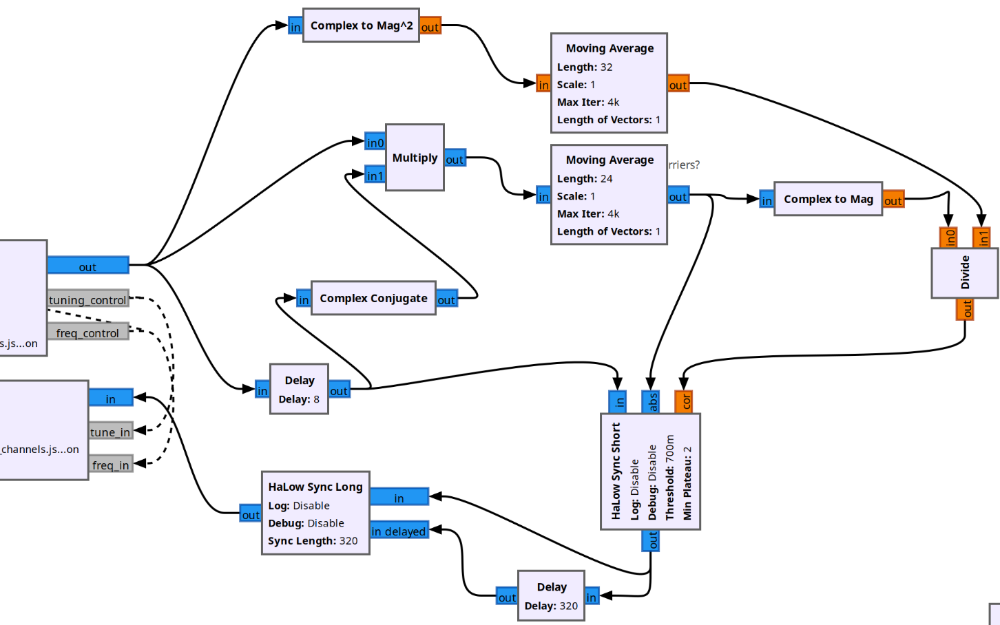

# gr-halow

🛑 requires GNU Radio 3.10.X 🛑

gr-halow is a first-of-its-kind implementation of IEEE 802.11ah Wi-Fi HaLow in GNU Radio that enables researchers, developers, and hobbyists to experiment with 802.11ah-based solutions using SDRs without the need to rely on commercial hardware implementations.

**Contents**
- [What is HaLow?](#what-is-halow)
- [How Do I Use It?](#how-do-i-use-it)
    - [HaLow Activity Scan](#halow-activity-scan)
- [Applications](#applications)
- [Resources](#resources)

## What is HaLow?

IEEE 802.11ah, also known as Wi-Fi HaLow, is an implementation of Wi-Fi in sub-1GHz bands. Due to its lower operating frequency than traditional Wi-Fi, Wi-Fi HaLow trades dimished data rates for longer transmission distances. This balance is favorable to internet-of-things (IoT) and other long-range applications. Read more about Wi-Fi HaLow on The Wi-Fi Alliance's website: [https://www.wi-fi.org/discover-wi-fi/wi-fi-certified-halow](https://www.wi-fi.org/discover-wi-fi/wi-fi-certified-halow).

You can view the IEEE Medium Access Control (MAC) and Physical Layer (PHY) specification for 802.11ah here: [https://ieeexplore.ieee.org/browse/standards/reading-room/page/viewer?id=9363693](https://ieeexplore.ieee.org/browse/standards/reading-room/page/viewer?id=9363693). It is free to access through the IEEE REading Room after creating an IEEE account. Chapter 23 specifically pertains to Sub 1GHz PHY. In case the link dies, the title of the document is "Part 11: Wireless LAN Medium Access Control (MAC) and Physical Layer (PHY) Specifications." It is the December 2020 revision of the 2016 standard.

## How Do I Use It?

_There is an active pull request to integrate some of these changes directly into gr-ieee802-11. If you'd like to help with the changes, see the pull request: [https://github.com/bastibl/gr-ieee802-11/pull/412](https://github.com/bastibl/gr-ieee802-11/pull/412)_

Due to the incomplete pull request, it is not possible to have gr-ieee802-11 work with both 802.11a/g/p and 802.11ah. However, you can easily switch between the currently installed version.

#### If you currently have gr-ieee802-11 installed (i.e. you can decode 802.11a/g/p) and want to decode 802.11ah...

```
# uninstall original gr-ieee802-11
cd ~/gr-ieee802_11 # change into the install directory
cd build
sudo make uninstall
cd ..
sudo rm -rf build

# install modified gr-ieee802-11
cd ~/ # change into home directory where you want to install
git clone https://github.com/irongiant33/gr-ieee802-11 gr-ieee802_11-modified
cd gr-ieee802_11-modified
git checkout maint-3.10
mkdir build
cd build
cmake ..
make -j4
sudo make install
sudo ldconfig
```

Then reload all blocks in GNU Radio

#### If you don't have gr-ieee802-11 installed and want to decode 802.11ah...

```
# install modified gr-ieee802-11
cd ~/ # change into home directory where you want to install
git clone https://github.com/irongiant33/gr-ieee802-11 gr-ieee802_11-modified
cd gr-ieee802_11-modified
git checkout maint-3.10
mkdir build
cd build
cmake ..
make -j4
sudo make install
sudo ldconfig
```

Then reload all blocks in GNU Radio

#### If you have gr-ieee802-11-modified installed (i.e. you can decode 802.11ah) and want to decode 802.11a/g/p...

```
# uninstall modified gr-ieee802-11
cd ~/gr-ieee802_11-modified # change into the install directory
cd build
sudo make uninstall
cd ..
sudo rm -rf build

# install original gr-ieee802-11
cd ~/gr-ieee802_11 # change into the original install directory
mkdir build
cd build
cmake ..
make -j4
sudo make install
sudo ldconfig
```

Then reload all blocks in GNU Radio

## Applications

Below are some example applications of `gr-halow`. See the [resources](#resources) section for some HaLow applications that other creators have demonstrated. Make sure you have the modified version of gr-ieee802-11 installed as per the [How Do I Use It](#how-do-i-use-it) section.

### Troubleshooting HaLow Network

**RX only troubleshooting is possible**

🚧 Under Construction - decoding the Signal and Data Fields has not been achieved yet 🚧

### Full HaLow Client

**requires TX/RX functionality for the SDR**

🚧 Under Construction - troubleshooting and HaLow transmission has not been achieved yet 🚧

### Scanning for HaLow Networks

The HaLow activity scan loops through HaLow channels in a provided `json` file and tries to find a HaLow packet by correlating a known sequence in the packet's short and long training fields. For this reason, HaLow Activity Scan is more precise than an energy detector; however, there are still some false alarms. 

The scanner currently works best on 1 MHz channels. See the file [`flowgraphs/1mhz_halow_channels.json`](flowgraphs/1mhz_halow_channels.json) for a `json` file listing all 1 MHz channels in the US band. If you'd like to scan all channels in the US, reference the [`flowgraphs/halow_channels.json`](flowgraphs/halow_channels.json)

To run the activity scan, open [`flowgraphs/halow_scan.grc`](flowgraphs/halow_scan.grc)
- Modify Soapy custom source as needed for your specific SDR driver
- Modify the `halow_channel_json_filename` variable to point to the absolute path of the halow channel json file
- Make sure the flowgraph connections and values match the picture below. Sometimes when uninstalling the original gr-ieee802_11 and installing the modified version for HaLow decoding, GNU Radio flips the connections around for the "HaLow Sync Short" and "HaLow Sync Long" block. The `tuning_control` connection goes to `tune_in` and `cmd` on the Soapy custom source. The `freq_control` connection goes to `freq_in` and `freq` on the Frequency Xlating FIR Filter.



Run the flowgraph. You should see printouts in GNU Radio that notify you of the HaLow channels that have activity

For advanced use:
- Modify the `upper detection threshold` parameter of the "HaLow Usage Detector" block. Increasing the threshold will increase your detections and increase false alarms. Reducing it will reduce detections and decrease false alarms.
- Modify the `loiter time` of the "HaLow Scan Controller" block. This value is approximately measured in seconds, but it works by counting the number of samples that pass through the controller so it might not be the most precise measurement. Increasing the loiter time will increase the amount of time the controller lingers on each channel, increasing the chance of detection but reducing the speed at which all channels are scanned. Decreasing the loiter time will reduce the amount of time the controller lingers on each channel, decreasing the chance of detection but increasing the speed at which all channels are scanned.
- Modify `sdr_center_freq` block's default value. This will change the center frequency that your SDR starts its scan. You can also change the start and stop value if you wish to scan channels outside of the US range, as long as you have those channels also set in the `json` file.
- Modify `input_samp_rate` value. Increasing this will reduce the amount of times that the SDR will have to retune in order to scan all HaLow channels. Decreasing this will increase the amount of times that the SDR will have to return in order to scan all HaLow channels. The minimum value is 1 MHz because that is the smallest HaLow channel width. This should be an even multiple of 1 MHz. 


## Resources

### Software

1. (I was not able to get this to build) imec-idlab HaLow visualizer and emulator for [NS3](https://www.nsnam.org/)
    - IEEE 802.11ah implementation for NS3: [https://github.com/imec-idlab/IEEE-802.11ah-ns-3](https://github.com/imec-idlab/IEEE-802.11ah-ns-3)
	- IEEE 802.11ah visualizer for NS3: [https://github.com/imec-idlab/ahVisualizer](https://github.com/imec-idlab/ahVisualizer)
2. (untested) BATMAN 802.11s over HaLow: [https://github.com/manikmakki/batman-over-halow/tree/main](https://github.com/manikmakki/batman-over-halow/tree/main)
3. IQ Dataset for 802.11ah (among other IoT signals): [https://github.com/JaronFontaine/Sub-GHz-IQ-signals-dataset](https://github.com/JaronFontaine/Sub-GHz-IQ-signals-dataset)

### Media

1. Ben Jeffrey on YouTube gives an overview of IEEE 802.11ah: [https://www.youtube.com/watch?v=qF0BHnmi9j8](https://www.youtube.com/watch?v=qF0BHnmi9j8)
2. Cemaxecuter on YouTube uses HaLow for various applications
	- introduction and propagation analysis [https://www.youtube.com/watch?v=Bw6cs0_R-oQ](https://www.youtube.com/watch?v=Bw6cs0_R-oQ)
	- remote control of Pluto SDR: [https://www.youtube.com/watch?v=BNC8uKlmLfw&pp=ygURY2VtYXhlY3V0ZXIgaGFsb3c%3D](https://www.youtube.com/watch?v=BNC8uKlmLfw&pp=ygURY2VtYXhlY3V0ZXIgaGFsb3c%3D)
	- 1km remote connection: [https://www.youtube.com/watch?v=QGt4kE58CEQ&t=394s&pp=ygURY2VtYXhlY3V0ZXIgaGFsb3c%3D](https://www.youtube.com/watch?v=QGt4kE58CEQ&t=394s&pp=ygURY2VtYXhlY3V0ZXIgaGFsb3c%3D)
3. Newracom (one of the HaLow fabless chip manufacturers) tests over 1000 HaLow devices at once: [https://www.youtube.com/watch?v=xd0e3nH0KzI](ttps://www.youtube.com/watch?v=xd0e3nH0KzI)
4. Morse Micro (another fabless HaLow chip manufacturer) verifies HaLow functionality over 3km: [https://www.youtube.com/watch?v=2xlUijXucoM](https://www.youtube.com/watch?v=2xlUijXucoM)

### Commercial HaLow Devices

Other devices exist on the market, but these are two that I own and can recommend

1. Teledatics XPAH: [Teledatics Documentation](https://teledatics.com/docs/)
2. Alfa HaLow-U: [https://store.rokland.com/products/alfa-network-halow-u-802-11ah-halow-usb-adapter-support-ap-client-mode](https://store.rokland.com/products/alfa-network-halow-u-802-11ah-halow-usb-adapter-support-ap-client-mode)
