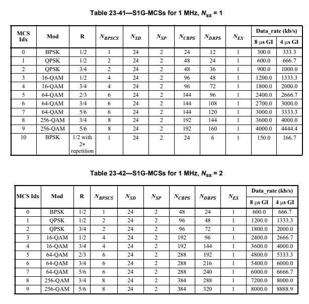

Testing between two devices, no encryption on Channel 48. Channel 48 is a 1 MHz channel centered at 920.5 MHz. Even with no information moving over the network, it is fairly chatty:


according to docs, MCS 10 is BPSK with R = 1/2 with 2x repetition. This differs from MCS 0 that is also BPSK but R = 1/2, no repetition. With a 8us guard interval, you can expect 150kbps. Going to start simple and try to implement MCS 0 to start, then I'll progress up the MCS in complexity



based off of the `halow-capture.sigmf-data` looking at the symbol crossings (or what I'm guessing are the symbol crossings) on the time sink, I think the sps is somewhere between 16 and 20 which would be a 500kbaud or 650kbaud signal.

## view and modify MCS on HaLow

To view MCS:

```
ip a # ensure HaLow is booted, you should have an IP address. If not booted, serial in and enter `boot` command
sudo tio -b 115200 /dev/ttyACM0  # or whatever port the halow is connected to
cd /usr/bin
cli_app
show config
```


To change MCS (assuming you are already serialled into HaLowU after viewing the MCS above):

```
set rc off # turns rate control off; otherwise HaLow will negotiate best MCS for the link
test mcs 0 # enables MCS 0. Replace 0 with desired MCS, valid range is 0 to 10, inclusive
show config # verify mcs is set.
```

## testing link speed

`iperf3` is already compiled on the HaLow-U. To use:

On the server:

```
ip a # ensure you have an IP from the HaLow U, if not, enter the `boot` command after serialling in
sudo tio -b 115200 /dev/ttyACM0 # or whatever port your HaLow is connected to
cd /usr/bin
iperf3 -s -p 4444
```

On the client: **remember to enter the IP of the HaLowU, not the client!**

```
ip a # ensure you have an IP from the HaLow U, if not, enter the `boot` command after serialling in
sudo tio -b 115200 /dev/ttyACM0 # or whatever port your HaLow is connected to
cd /usr/bin
iperf3 -c 192.168.100.2 -p 4444 # or whatever the IP address of the HaLow-U node is
```

Example iperf test for MCS0


see results of other iperf3 tests in the *.sigmf-meta files, summarized below. Not entirely consistent with the slight drop in MCS 0 rates from 1MHz-2MHz, but everything else seems to make sense.

| bandwidth | mcs | sender rate MBits/sec | receiver rate MBits/sec |
|-----------|-----|--------|----------|
| 1 MHz     | 0   |  0.551   |   0.496  |
| 1 MHz     | ?   |  1.53  |   1.46   |
| 2 MHz     | 0   |  0.472  |  0.421   |
| 2 MHz     | ?   |  2.37  |   2.31   |
| 4 MHz     | 0   |  0.934  |   0.874  |
| 4 MHz     | ?   | 2.89  |   2.83   |

**must repeat this process on every device in your network**

## visual verification of number of OFDM subcarriers in halow

_technically_ "for a 1 MHz S1G PPDU transmission, the 1 MHz is divided into 32 subcarriers. The signal is transmitted on subcarriers -13 to -1 and 1 to 13 with 0 being the center (DC) subcarrier" (specification, p.3215, section 23.3.7). Together with the subcarrier spacing of 31.25 kHz, this gives the whole 1 MHz so we know exactly which frequency each subcarrier is on. 
- Pilots (`subcarrier_idx = [-7, 7]`) means that
- Generally, the equation for subcarrier frequency offset from center is `subcarrier_freq = subcarrier_spacing_khz/2 + subcarrier_idx * subcarrier_spacing`

Table 23-7 of the documentation is summarized below

| Field | 1 MHz | 2 MHz | 4 MHz | Guard Interval Duration |
|-------|-------|-------|-------|-------------------------|
| Short Training Field (STF) | 6  | 12 | 24 | The OFDM symbols of the STF field do not have a guard interval |
| Long Training Field 1 (LTF1) | 26 | 56 | 114 | For bandwidths >= 2 MHz, duration is T_gi2. For 1 MHz bandwidth, duration is T_gi2 for first and second symbols, and T_gi for third and fourth symbols. |
| S1G | 26 | 52 | 104 | T_gi |
| S1G-A for long format | N/A | 52 | 104 | T_gi |
| D-STF for long format | N/A | 12 | 24 | N/A |
| LTF2~LTF_N_LTF | 26 | 56 | 114 | T_gi |
| D-LTF for long format | N/A | 56 | 114 | T_gi |
| S1G-B for long format | N/A | 56 | 114 | T_gi |
| First Data Symbol | 26 | 56 | 114 | T_gi |
| From second to the last data symbols | 26 | 56 |114 | T_gi or T_gis |
| S1G_DUP_1M-Data | N/A | 52 | 104 | T_gi or T_gis |
| S1G_DUP_2M-Data | N/A | N/A | 112 | T_gi or T_gis |

for the 1 MHz captures, you can see evidence of this in [n_subcarriers_1mhz_1.png](media/n_subcarriers_1mhz_1.png) and [n_subcarriers_1mhz_2.png](media/n_subcarriers_1mhz_2.png). Counting the "strong" peaks you get 26, and the cursors highlight the STF where 6 carriers are evident. 


Given the timing constraints and the packet construction below, we can try and compare some of the length in Inspectrum between actual/expected. Note this is specifically for the 1M packets.


It takes 560us to get to the LTF2-LTFN field. This roughly lines up with the dense red subcarrier spike width in 1MHz inspectrum captures.

## Misc Resources

- Wi-Fi HaLow breakdown and performance results by Troy Martin (MARCH 2024): [https://youtu.be/oFVj1RES9TU?si=XjW0Y5oUUU09URXw](https://youtu.be/oFVj1RES9TU?si=XjW0Y5oUUU09URXw)
- MCS and Data Rate Table for WiFi Standards [https://mcsindex.net/](https://mcsindex.net/)

## Todo

- [ ] Range testing at this channel, propagation analysis model. While you are range testing, see if you can force the lowest number of spatial streams and the lowest MCS.
- [ ] try adding attenuators or take HaLow-U at extended range to force lower MCS?
- [x] how can you determine whether there is 1 or multiple spatial streams? **answer**: I am fairly certain there can only be 1 spatial stream on the HaLowU because there is only 1 antenna. These explanations helped my understanding: [https://www.digitalairwireless.com/articles/blog/wi-fi-spatial-streaming-explained](https://www.digitalairwireless.com/articles/blog/wi-fi-spatial-streaming-explained). Also, the definition of a spatial stream in the HaLow specification document is "spatial stream: One of several streams of bits or modulation symbols that might be transmitted over multiple spatial dimensions that are created by the use of multiple antennas at both ends of a communications link." (p.170).
- [x] is there a way to verify on the HaLow which MCS index is being used? It might be automatically negotiated based on what is available; will also have to read through the specification more to determine if this is the case. What worries me is that the network config picture shows that the TX and RX rate is 6 Mbps which means that the HaLow's may have negotiated for multiple spatial streams and a higher MCS. Just with a cursory look, it seems like this time domain plot is multi-level phase shift keying. For BPSK I would expect constant amplitude

    - "MCS Negotiation Support - Indicates if the STA supports control response MCS negotiation feature. Set to 0 if not supported. Set to 1 if supported." p.1345 of the specification within the "9.4.2.200.2 S1G Capabilities Information field" section
    - section "9.4.2.200.3 Supported S1G-MCS and NSS Set field" does the following: "convey the combinations of S1G-MCSs and spatial streams that a STA supports for reception and the combinations that it supports for transmission" p.1346. Its unclear where this is advertised & I'm not sure how to contorl this with HaLow-U, but it is possible that this is what is happening without my knowledge. In general, section 9 covers the frame formats so this is after modulation.
    - **answer**: Yes, see [view and modify MCS on HaLow](#view-and-modify-mcs-on-halow)
- [x] how many spatial streams does the Halow-U support? **answer** 4, see [mcs picture](media/mcs-nsss.png)
    - according to HaLow-U docs, it only supports 1/2/4 MHz channels, so you don't have to worry about 8 or 16 MHz channels from the IEEE specification. See specification of HaLow-U here: [https://store.rokland.com/products/alfa-network-halow-u-802-11ah-halow-usb-adapter-support-ap-client-mode](https://store.rokland.com/products/alfa-network-halow-u-802-11ah-halow-usb-adapter-support-ap-client-mode)
- [x] Attempt Wireshark FIFO to see if it detects Wi-Fi frames? **answer**: this won't be possible until there is a program that processes HaLow frames from the PHY. The reason why some people can do this with bluetooth or wifi is that there are decoders (like ice9 bluetooth sniffer) that parse raw RF into layer 2 that Wireshark can read.
- [ ] start building modem examples for a basic chatroom style tx/rx so you can lean on these for your halow tx/halow rx. Generate BPSK at 1 MHz bandwidth and compare with HaLow capture
- [ ] analyze the BPSK capture. Why do the two captures look the same even though the first capture is likely at a higher MCS? Perhaps the preambles are always the same for synchronization, and the data is still different. [https://www.sigidwiki.com/wiki/Phase_Shift_Keying_(PSK)#google_vignette](https://www.sigidwiki.com/wiki/Phase_Shift_Keying_(PSK)#google_vignette)
- [ ] try capturing other MCS values?
- [ ] run iperf3 with higher MCS values to make sure the data rate values make sense. I tried running it with MCS 8 & 9 but it was not successful - its possible the HaLowU doesn't support MCS 8 and 9.
- [ ] how to determine SPS? since the web app told me that I should expect 6 Mbps, can you use this information in tandem with the modulation scheme to determine SPS? For example, 6 Mbps with 16QAM should yield 1.5M baud? If this is true, maybe my timing estimates are off. Even 6 Mbps with 64 QAM would yield 1M baud and I'm seeing half that rate still.

    - [ ] if you have the HaLowU plugged in, does it appear as a Wireshark capture device?
- [ ] start building modem examples for a basic chatroom style tx/rx so you can lean on these for your halow tx/halow rx
- [ ] analyze the BPSK capture. Did some analysis using SDRAngel's Capture Analyzer, but I'm not super proficient with the tool yet so I don't have anything conclusive. It did appear to look like BPSK, but I didn't get PLL lock or any metadata out.
- [ ] how to determine SPS? since the web app told me that I should expect 1 Mbps, can you use this information in tandem with the modulation scheme to determine SPS? For example, 6 Mbps with 16QAM should yield 1.5M baud? If this is true, maybe my timing estimates are off. Even 6 Mbps with 64 QAM would yield 1M baud and I'm seeing half that rate still.
- [ ] maybe you just need more gain following the SigMF data?
- [ ] try using gr-ieee80211 for some of the standard channels? It might possibly recognize the data, just in a different band. break out gr-ieee80211 to see if you can get anything to make sense. It might not work end-to-end, but it could serve as a good basis.
    - started to break this out and have it in the `halow_rx.grc` flowgraph. When I enable/disable some of the logging, it seems that the receive chain recognizes the packets and demodulation but likely does not recognize the MAC. Nothing makes sense in Wireshark or the "WiFi Decode MAC" block. The checksum keeps dropping, but it is getting full packets.
- [ ] try suscan for analysis capabilities? 
- [x] been 6 years since this was contributed to, but does it work? [https://github.com/dverhaert/GNUradio-802.11ah](https://github.com/dverhaert/GNUradio-802.11ah)
    - essentially this is a copy of gr-ieee80211, so it is not worth exploring.
- [ ] any documents from newracom, morse micro that might help?
- [ ] build energy detector and correlator that could identify active HaLow channels?
- [ ] make a 2MHz capture at various MCS because that is what the old WiFi supported at a minimum. 1 MHz is unique to HaLow. See 23.3.8.3 of specification for 1 MHz format.
- [ ] does HaLow also use Viterbi encoding/decoding? 
    - 23.3.9.4.2 "BCC encoder parsing operation": "the BCC encoder parsing operation for S1G PPDUs is the same as those specified in 21.3.10.5.2". Section 23.3.9.4.4 "LDPC coding" covers the modifications to LDPC code and encoding process for S1G single user (SU) PPDU.
- [ ] how long is the STF/LTF for different bandwidths? 
- [ ] read into the WiFi Sync Short and WiFi Sync Long blocks from gr-ieee80211 because it does match with the order of the STF and LTF1 in the PPDU. If you get those right, you may be able to decode the SIG field, but there is another LTF2 after SIG which does not track with the gr-ieee80211 flowgraph. Decoding the SIG field would be a good step in the right direction though
    - this will also help you answer the question "why delay by 16 samples?", "is there significance to a 48 'window size' moving average?", and "how does a 320 'sync length' impact the WiFi long sync?", "what is the significance of the FFT size 64?"
    - "is there a significance to a 48 'window size' moving average?" if 48 is the number of coded bits per subcarrier in standard WiFi, then according to Table 23-41 above, the number of coded bits per subcarrier (N_CBPS) is 24 for 1 MHz MCS=0.
    - "what is the significance of the FFT size 64?" might have something to do with the fact there is a filter kernel with 64 complex samples in the WiFi Sync Long source code that is correlated with the input: https://github.com/bastibl/gr-ieee802-11/blob/ce7097384bb29f9e73777cf1458a072a90430528/lib/sync_long.cc#L257
- [ ] the 1MHz interleaver is different, as shown in [1mhz interleaver](media/1mhz_interleaver.png). How do you implement the new one?
- [ ] test your theory of the autocorrelation hidden in plain sight with the wifi_rx.grc flowgraph. Use a canned example to make it easier.
