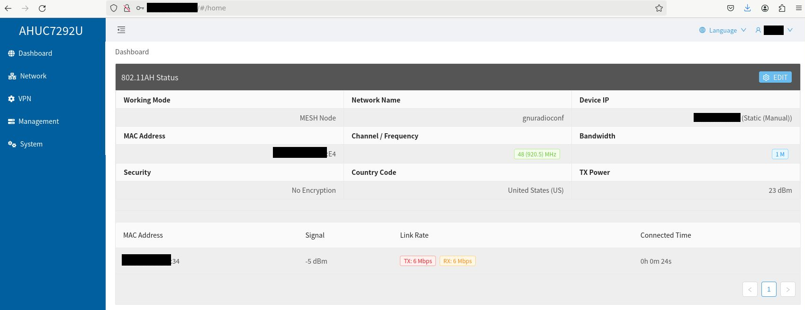
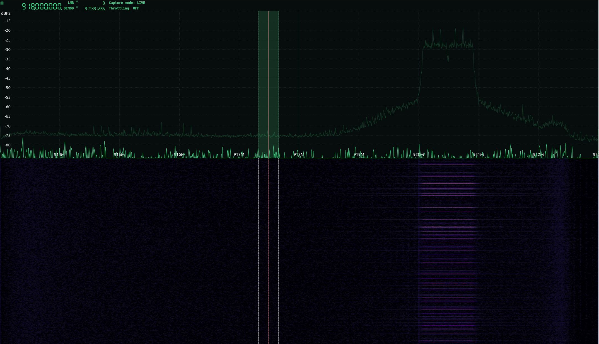

Testing between two devices, no encryption on Channel 48. Channel 48 is a 1 MHz channel centered at 920.5 MHz. Even with no information moving over the network, it is fairly chatty:

## Todo

- [ ] Range testing at this channel, propagation analysis model