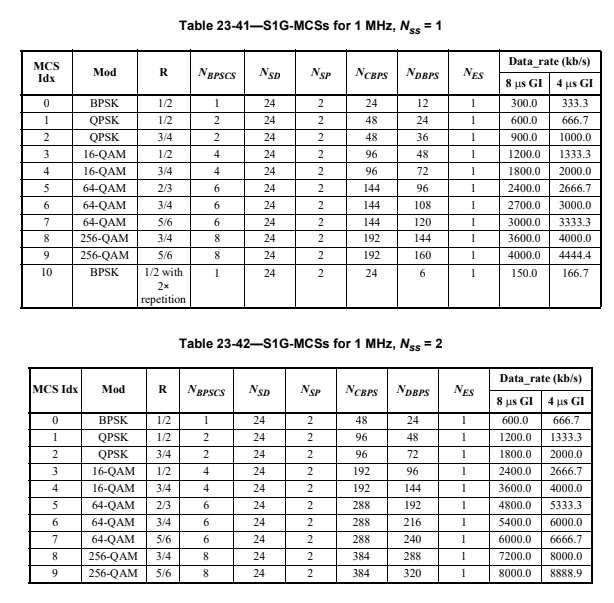
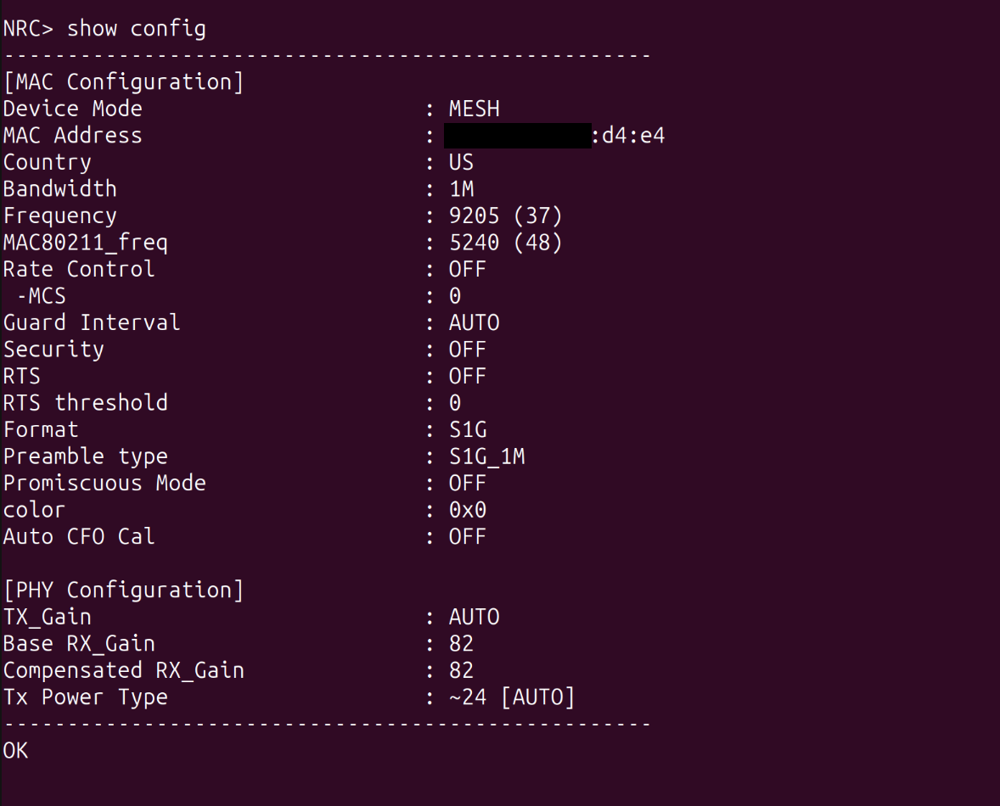
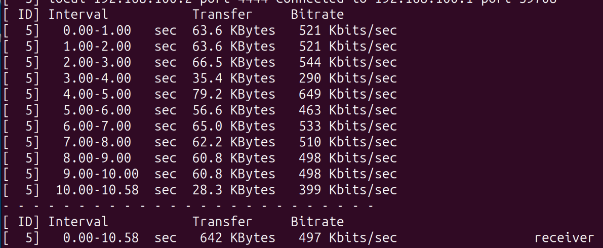
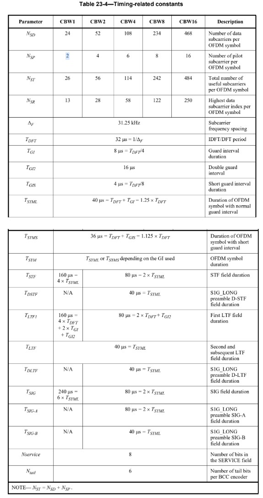
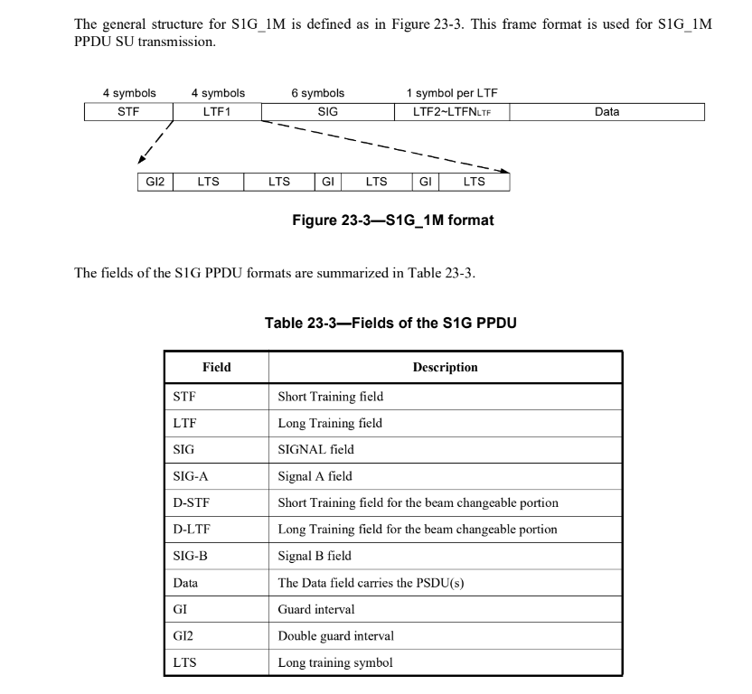
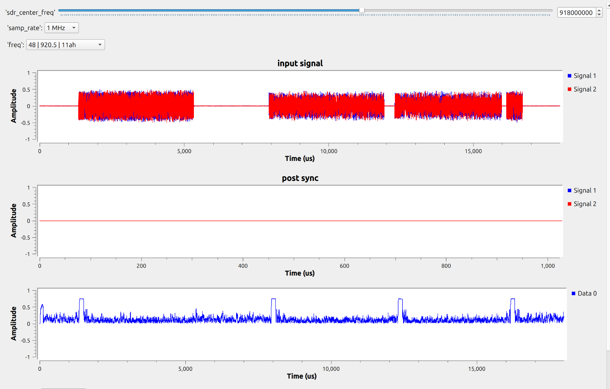
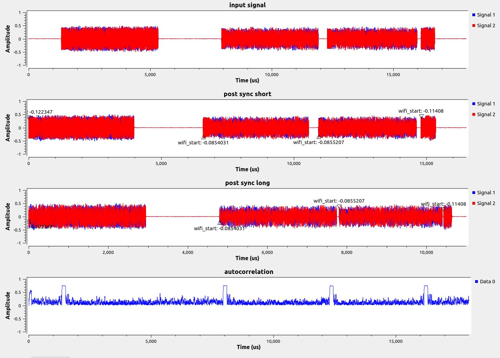
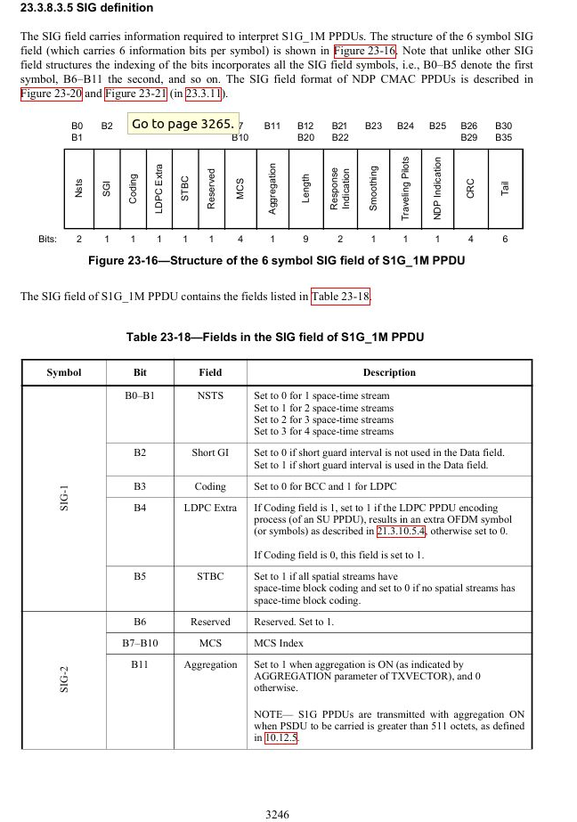
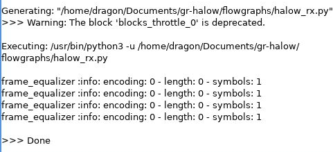
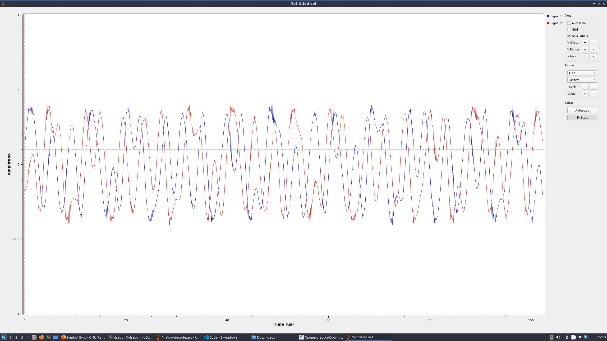

- [general setup description](#general-setup-description)
- [view and modify MCS on HaLow-U](#view-and-modify-mcs-on-halow)
- [testing link speed](#testing-link-speed)
- [visual verification of subcarriers](#visual-verification-of-number-of-ofdm-subcarriers-in-halow)
- [ieee standards breakdown](#ieee-standards-breakdown)
- [wifi synchronization](#wifi-synchronization)
- [wifi frame equalization](#wifi-frame-equalization)
- [wifi mac decoding](#wifi-mac-decoding)
- [misc resources](#misc-resources)
- [todo](#todo)

## general setup description

Going to work on a 1MHz channel with no encryption on MCS-0 even though 2MHz and 4MHz channels are available on HaLow-U. When I get this combination working, I will progress up MCS and then progress up channel width. 

Below is a picture of the network configuration as seen in the admin page on each HaLow-U


To set the MCS to 0 and avoid rate control changing the MCS, refer to the section [view and modify MCS on HaLow](#view-and-modify-mcs-on-halow)

Below is a picture of the general spectrum waterfall. Unlike gr-ieee802_11, which is based on 802.11a/g, 802.11ah is rooted in 802.11a. All this to say the number of subcarriers are different and we won't be able to blindly apply gr-ieee802_11 to decode 802.11ah, but much of the underlying functionality should be the same. See [ieee standards breakdown](#ieee-standards-breakdown) for more details on the comparison.

Below is a picture of the spectrum waterfall. For visual verification of the subcarriers, refer to [visual verification of subcarriers](#visual-verification-of-number-of-ofdm-subcarriers-in-halow)


## view and modify MCS on HaLow



To view MCS:

```
ip a # ensure HaLow is booted, you should have an IP address. If not booted, serial in and enter `boot` command
sudo tio -b 115200 /dev/ttyACM0  # or whatever port the halow is connected to
cd /usr/bin
cli_app
show config
```



To change MCS (assuming you are already serialled into HaLowU after viewing the MCS above):

```
set rc off # turns rate control off; otherwise HaLow will negotiate best MCS for the link
test mcs 0 # enables MCS 0. Replace 0 with desired MCS, valid range is 0 to 10, inclusive
show config # verify mcs is set.
```

## testing link speed

`iperf3` is already compiled on the HaLow-U. To use:

On the server:

```
ip a # ensure you have an IP from the HaLow U, if not, enter the `boot` command after serialling in
sudo tio -b 115200 /dev/ttyACM0 # or whatever port your HaLow is connected to
cd /usr/bin
iperf3 -s -p 4444
```

On the client: **remember to enter the IP of the HaLowU, not the client!**

```
ip a # ensure you have an IP from the HaLow U, if not, enter the `boot` command after serialling in
sudo tio -b 115200 /dev/ttyACM0 # or whatever port your HaLow is connected to
cd /usr/bin
iperf3 -c 192.168.100.2 -p 4444 # or whatever the IP address of the HaLow-U node is
```

Example iperf test for MCS0



see results of other iperf3 tests in the *.sigmf-meta files, summarized below. Not entirely consistent with the slight drop in MCS 0 rates from 1MHz-2MHz, but everything else seems to make sense.

| bandwidth | mcs | sender rate MBits/sec | receiver rate MBits/sec |
|-----------|-----|--------|----------|
| 1 MHz     | 0   |  0.551   |   0.496  |
| 1 MHz     | ?   |  1.53  |   1.46   |
| 2 MHz     | 0   |  0.472  |  0.421   |
| 2 MHz     | ?   |  2.37  |   2.31   |
| 4 MHz     | 0   |  0.934  |   0.874  |
| 4 MHz     | ?   | 2.89  |   2.83   |

**must repeat this process on every device in your network**

## visual verification of number of OFDM subcarriers in halow

_technically_ "for a 1 MHz S1G PPDU transmission, the 1 MHz is divided into 32 subcarriers. The signal is transmitted on subcarriers -13 to -1 and 1 to 13 with 0 being the center (DC) subcarrier" (specification, p.3215, section 23.3.7). Together with the subcarrier spacing of 31.25 kHz, this gives the whole 1 MHz so we know exactly which frequency each subcarrier is on. 
- Pilots (`subcarrier_idx = [-7, 7]`) means that
- Generally, the equation for subcarrier frequency offset from center is `subcarrier_freq = subcarrier_spacing_khz/2 + subcarrier_idx * subcarrier_spacing`

Table 23-7 of the documentation is summarized below

| Field | 1 MHz | 2 MHz | 4 MHz | Guard Interval Duration |
|-------|-------|-------|-------|-------------------------|
| Short Training Field (STF) | 6  | 12 | 24 | The OFDM symbols of the STF field do not have a guard interval |
| Long Training Field 1 (LTF1) | 26 | 56 | 114 | For bandwidths >= 2 MHz, duration is T_gi2. For 1 MHz bandwidth, duration is T_gi2 for first and second symbols, and T_gi for third and fourth symbols. |
| S1G | 26 | 52 | 104 | T_gi |
| S1G-A for long format | N/A | 52 | 104 | T_gi |
| D-STF for long format | N/A | 12 | 24 | N/A |
| LTF2~LTF_N_LTF | 26 | 56 | 114 | T_gi |
| D-LTF for long format | N/A | 56 | 114 | T_gi |
| S1G-B for long format | N/A | 56 | 114 | T_gi |
| First Data Symbol | 26 | 56 | 114 | T_gi |
| From second to the last data symbols | 26 | 56 |114 | T_gi or T_gis |
| S1G_DUP_1M-Data | N/A | 52 | 104 | T_gi or T_gis |
| S1G_DUP_2M-Data | N/A | N/A | 112 | T_gi or T_gis |

for the 1 MHz captures, you can see evidence of this in [n_subcarriers_1mhz_1.png](media/n_subcarriers_1mhz_1.png) and [n_subcarriers_1mhz_2.png](media/n_subcarriers_1mhz_2.png). Counting the "strong" peaks you get 26, and the cursors highlight the STF where 6 carriers are evident. 



Given the timing constraints and the packet construction below, we can try and compare some of the length in Inspectrum between actual/expected. Note this is specifically for the 1M packets.



It takes 560us to get to the LTF2-LTFN field. This roughly lines up with the dense red subcarrier spike width in 1MHz inspectrum captures.

## ieee standards breakdown

Important chapters
- Ch15 is 802.11 (dsss in 2.4 GHz, 1Mbps, 2Mbps rates) p.2749
- Ch16 is 802.11b (HT dsss in 2.4ghz 1, 2, 5.5, 11Mbps rates) p.2773
- Ch17 is 802.11a (ofdm in 5ghz, 5MHz, 10MHz, 20MHz channel widths 6,9,12,18,24,36,48,54 Mbps rates in 10MHz channel) p.2802
    - P.2807 PPDU format
    - P.2810-2811 I'm pretty sure this is 802.11a modulation dependent parameters and timing parameters. It looks similar to HaLow at just 10x the rates
- Ch18 is 802.11b-corrigendum1 (extended rate phy "ERP" dsss in 2.4ghz, backwards compatible with 802.11a/b) p 2848
- Ch19 is 802.11g (ofdm in 2.4ghz, but also backwards compatible with ch18 dsss in 2.4ghz and ch17 ofdm in 5ghz) p.2860
    - P.2862 - definition of non-ht, ht-mf, ht-gf. Pretty sure gr-ieee80211 only supports non-ht. Support for ch17/18 packets. Mixed format (MF) has preamble that can be decided by ch17/18 but data that cannot. Greenfield (GF) cannot be recognized at all by ch17/18.
    - P.2873 PPDU format. Makes sense for delay of 16us because STF and LTF are each 8us. 
    - P.2880 timing parameters. 48 complex data numbers. 52 sub carriers, highest sun carrier index is 26. 312.25 khz subcarrier spacing
- Ch20 is directional multi gig, 802.11ad? p.2962
- Ch21 is very high throughput, 802.11ac? p.3010
- Ch22 is television very high throughput 802.11af? p.3137
- Ch23 is 802.11ah (ofdm in S1G, essentially 802.11g knocked down 10x) p.3186

802.11a is basis for halow. 802.11ah is thus an amendment by group "h" to the 802.11a spec. 6 OFDM symbols for the SIG field. 

802.11a/802.11g supported in gr-ieee80211. Both of these use 1 OFDM symbol for their SIG field.

CSD = cyclic shift diversity, there is no cyclic shift for 1 spatial stream (table 23-17)

Table 23-10 on p158 of S1G portions on p3223 of full spec shows that there is only 1 LTF for transmissions that only use 1 spatial stream. This means there is no LTF field after the SIG field for 1MHz transmissions.

Section 17.3.4.2 p.2815 has rate bit codes for 802.11a that comes native with `frame_equalizer.cc`. For example:
- `1101` gets 6 Mbps for 20 MHz channels, 3 Mbps for 10 MHz channels, 1.5 Mbps for 5 MHz channels
- `0101` gets 12 Mbps for 20 MHz channels, 6 Mbps for 10 MHz channels, 3 Mbps for 3 MHz channels

`sync_length` input into `sync_long` block within `wifi_rx.grc` examples is 320. This corresponds to the number of samples that are in the PHY PREAMBLE. Check out Table 17-5 for verification of this (p.2810). This is constant regardless of the channel bandwidth, 20 MHz, 10 MHz, 5 MHz. This is because the preamble length (time wise) changes based off of the channel bandwidth but the preamble length (samples) does not change.
- when `offset == sync_length`, the `sync_long` block starts to search for frames.

```
*--------------*--------*------*
| PHY PREAMBLE | SIGNAL | DATA |
*--------------*--------*------*
```

PHY PREAMBLE in 802.11a/g is 10x repetitions of a short sequence for AGC acquisition, timing, and coarse frequency correction. Then there are 2x repetitions of the long sequuences for fine frequency & channel estimation. It is 16us long (for a 20MHz channel) which means there are 320 samples for the preamble. Then, the SIGNAL field is 80 samples long (because there is just 1 OFDM symbol) and comprises the following information:

```
*------*----------*--------*--------*------*
| RATE | RESERVED | LENGTH | PARITY | TAIL |
*------*----------*--------*--------*------*
```

The rate is 4 bits, 1 reserved bit, 12 length bits, 1 parity bit, and 6 tail bits. The DATA field repeats as many times as necessary (i.e. transmits as many OFDM symbols as necessary) to send the data, but generally is formatted as follows:

```
*---------*------*------*-----*
| SERVICE | PSDU | TAIL | PAD |
*---------*------*------*-----*
```

Service field is 16 bits, PSDU varies depending on the data you want to send, the TAIL is 6 bits, and the PAD varies depending on the data you want to send such that there are an even number of OFDM symbols sent.

## WiFi Synchronization



the above image was from commit `25a4858795a04dd1569dcee04be4bb9633dc4705` on gr-halow and `ef66318257fdfba0914792cbccbcf6e319b918e1` on modified fork of gr-ieee80211. You can see the bottom output from the autocorrelation part in the gnu radio flowgraph synchronizes roughly to the beginning of frame but we still don't have any output from wifi sync long.

This is partly due to the fact that for some reason when gr-ieee80211 is rebuilt, it sometimes reconnects the flowgraph in the wrong spots. It will mess up the inputs to both wifi_sync_short and wifi_sync_long, so you have to make sure they are routing to the right spots.

Secondly, I was able to update the LONG FIR filter kernel in sync_long_impl.cc using `utils/create_long_halow.R` within gr-ieee80211. Using this, I was able to produce the following sync output:



I also captured [sync-plots.png](media/sync-plots.png) but there are multiple tags which I believe is from the wrong kernel convolving over the WiFi samples. WiFi sync short and WiFi sync long are decimating blocks, but they do not decimate linearly; it is based on whether the threshold is exceeded in the autocorrelation phase, so I just guessed & refined my guesses for how many samples the plot should show. I knew 4 frames needed to appear so that is what we see in the plots. There is also a clean tag at the start of each frame which lets me know that we are likely good to go to the next phase of the processing stream.

## WiFi Frame Equalization

The role of frame equalization is to correct for the frequency offset detected in the synchronization step and to also normalize the power on each of the data subcarriers so that the IQ constellation can be sliced and turned into binary data. 

For the purpose of HaLow, we focus on modification of the least squares equalizer (LS) in `lib/equalizer/ls.cc`. Using this information, we can then decode the SIG field of HaLow to determine various information shown below:



Even though HaLow has 24 data subcarriers, the scheme used for MCS0 is BPSK 1/2 coding 2x repetition. This means out of 24 bits in each symbol, there are two repetitions of 12 bits. In those 12 bit repetitions, only 6 bits are data and the other 6 bits are the FEC.

In my implementation of the SIG field decoding, I only pull out the 4 bit MCS index and output it to the log. I got the following capture from enabling the log on WiFi Decode MAC in GNU Radio:



It might not look like much, but what I find important here is the fact there are 4 triggers which corresponds with the 4 frames that we detected. Furthermore, each of these triggers are consistent with the encoding scheme - 0, i.e. MCS 0. Other interesting fields in SIG are bits 12-20 in the 3rd and 4th symbol. These bits correspond to the length of the PSDU. Bits 26-29 of the 5th SIG OFDM symbol correspond to the CRC which is verified in the next step, [WiFi MAC decoding](#wifi-mac-decoding)

## WiFi MAC Decoding


## Misc Resources

- Wi-Fi HaLow breakdown and performance results by Troy Martin (MARCH 2024): [https://youtu.be/oFVj1RES9TU?si=XjW0Y5oUUU09URXw](https://youtu.be/oFVj1RES9TU?si=XjW0Y5oUUU09URXw)
- MCS and Data Rate Table for WiFi Standards [https://mcsindex.net/](https://mcsindex.net/)

ofdm is like threading in RF. fdm is multiprocessing. It lowers the rate of each stream so that the sum of the stream rates equals the desired bitrate of the whole signal. "in short, instead of sending serial symbols at a rate K/T over a channel with bandwidth W, K symbols in parallel, each at the rate of 1/T are sent over a sub-channel with bandwidth W/K." This helps when fading impacts the band that a signal is transmitted over to essentially create multiple sub-channels where fading doesn't impact signal reception. The alternative is a very complex equalizer.
- science direct article on OFDM, keysight signal structure for wifi

## Todo (priority order)

- [ ] fix compile error in the wifi frame equalizer, print out the different fields of the SIG field rather than its bit representation so you can visually compare the repetitions. Fix your synchronization until these values make sense.
- [ ] now that you have WiFi Frame Equalizer working, can you decode other MCS? The key assumption here would be that BPSK 1/2 with 2x repetition is used for the SIG field for all MCS.
- [ ] change the rest of ofdm_param and frame_param classes in `utils.cc` to match HaLow values. So far you only changed BPSK1_2.
- [ ] try using gr-ieee80211 for some of the standard channels? It might possibly recognize the data, just in a different band. break out gr-ieee80211 to see if you can get anything to make sense. It might not work end-to-end, but it could serve as a good basis.
    - started to break this out and have it in the `halow_rx.grc` flowgraph. When I enable/disable some of the logging, it seems that the receive chain recognizes the packets and demodulation but likely does not recognize the MAC. Nothing makes sense in Wireshark or the "WiFi Decode MAC" block. The checksum keeps dropping, but it is getting full packets.
    - [ ] p.4170 has some interesting time domain representation tables. Is this where the fixed 64 size complex FIR filter kernel comes from in the `sync_long_impl.cc`?
        - The LONG array in `sync_long_impl.cc` does not correspond to anything in the spec, but the LONG array in `base.cc` corresponds to Table I-5 in the Appendix. Where does the LONG array in `sync_long_impl.cc` come from?
    - [ ] does `sync_long_impl.cc` copy all of the samples for the entire WiFi frame after it finds the preamble? Or does it just copy the SIGNAL field?
    - [ ] what is `15` value on line 139 of `sync_long_impl.cc`? I thought it would've corresponded to a guard interval, but with a GI of 0.8us on Table 17-5 (p.2810), that would correspond to 16 samples, not 15. Maybe it is just an off by 1?
    - [ ] where does `MAX_GAP` and `MAX_SAMPLES` come from in the beginning of `sync_short.cc`? Maybe it comes from the MTU that drives how long DATA field could be at max, so MAX_SAMPLES is literally the maximum number of samples for the whole PPDU? If true, the PHY PREAMBLE and SIGNAL field together for a 20MHz channel (16us + 4us) would be 400 samples, leaving 140 for the DATA which does not make much sense...you would think it should be divisible by 80, or at least 64 (the length of one OFDM symbol plus GI or just the length of one OFDM symbol)
    - [ ] read into the WiFi Sync Short and WiFi Sync Long blocks from gr-ieee80211 because it does match with the order of the STF and LTF1 in the PPDU. If you get those right, you may be able to decode the SIG field, but there is another LTF2 after SIG which does not track with the gr-ieee80211 flowgraph. Decoding the SIG field would be a good step in the right direction though. This will also help you answer the following questions:
        - [x] how does a 320 'sync length' impact the WiFi long sync?
            - 320 samples is the sum of the time, in samples, of both the STF and LTF for 802.11a. See Table 17-5. Essentially, this whole autocorrelator would just be so that we could detect the frame from the STF/LTF then pass to frame equalizer to pull information out of the SIG field.
        - [x] why delay by 16 samples in the GRC flowgraph?
            - 16 samples corresponds to the guard interval length of 0.8us for 802.11a (see table 17-5)
        - [x] is there a significance to a 48 'window size' moving average?
            - if 48 is the number of coded bits per subcarrier in standard WiFi, then according to Table 23-41 above, the number of coded bits per subcarrier (N_CBPS) is 24 for 1 MHz MCS=0.
        - [x] what is the significance of the FFT size 64?
            - might have something to do with the fact there is a filter kernel with 64 complex samples in the WiFi Sync Long source code that is correlated with the input: https://github.com/bastibl/gr-ieee802-11/blob/ce7097384bb29f9e73777cf1458a072a90430528/lib/sync_long.cc#L257
            - should be due to the 64 total possible subcarriers in 802.11a/g
    - [ ] use gr-ieee802_11 built in simulation transceiver to figure out what right should look like
    - [ ] Focus in on one frame specifically, then debug along the chain while disabling downstream blocks. Do the sync blocks really detect where a frame is? If so, try and rewrite the deinterleave and descramble blocks. Just try and make some changes and see what happens.
    - [ ] Narrow your filter cutoff because you don't need all 1MHz. Nearly 100khz of frequency is free on either side of the signal. 
    - [x] Also, how many samples per ofdm symbol are there? 
        - 40 for HaLow, 1 MHz channel for a 40us OFDM symbol period. We should be able to determine this based on the timing. 1 MHz yields 1us sample period, so a delay of 16 samples yields a delay of 16us. This is the same as the double guard interval. 320 delay IIRC is the STF and LTF right before the SIG field. This would hold true no matter if it's WiFi or if it's halow. 
- [ ] p.3247 says that the SIG field is repeated 2x, so you need to incorporate that into your `frame_equalizer_impl.cc` code. I think you don't need to compare the repeated bits, but instead ensure that at least one of the repeated sets has a passing CRC. For now, you could probably just print both out. I'm pretty sure it goes SIG-1a, SIG-1b, SIG-2a, SIG-2b rather than repeating every bit individually.
    - right now you're only accounting for the first repetition
- [ ] is the following statement true? it seems to search for SHORT frames, but I think that the 1M signal does not have short/long frames - its frames are only one type. So now its possible the short and long correlate do not correspond to the STF and LTF but instead correspond with the different packet types. Then that means the different delays are trying to find whether the packet is a short or long type. The delay amount still might signify an autocorrelation with the duplicated STFs or LTFs. 
- [ ] analyze the BPSK capture. Why do the two captures look the same even though the first capture is likely at a higher MCS? Perhaps the preambles are always the same for synchronization, and the data is still different. [https://www.sigidwiki.com/wiki/Phase_Shift_Keying_(PSK)#google_vignette](https://www.sigidwiki.com/wiki/Phase_Shift_Keying_(PSK)#google_vignette)
    - [ ] analyze the BPSK capture. Did some analysis using SDRAngel's Capture Analyzer, but I'm not super proficient with the tool yet so I don't have anything conclusive. It did appear to look like BPSK, but I didn't get PLL lock or any metadata out.
    - [ ] try suscan for analysis capabilities? 
    - [ ] can you use sigdigger inspector to ID PSK/FSK/ASK as well as multi-level? now that you suspect halow is OFDM, can you actually verify 4QAM and BPSK for the different MCS?
- [ ] maybe you just need more gain following the SigMF data?
- [ ] check out 19.3.9.3.3 for STF construction (frame acquisition? don't really know the purpose)
- [ ] check out 21.3.8.3.5 for LTF construction (MIMO diversity)
- [ ] any documents from newracom, morse micro that might help?
- [ ] There is a MATLAB S1G waveform generator on the IEEE website (document number 11-14/0631). It can do 1 MHz & 2 MHz for 1-2 spatial streams and has a GUI to control it. Look into it?
- [ ] if you have the HaLowU plugged in, does it appear as a Wireshark capture device?
- [ ] start building modem examples for a basic chatroom style tx/rx so you can lean on these for your halow tx/halow rx. Generate BPSK at 1 MHz bandwidth and compare with HaLow capture
- [ ] start building modem examples for a basic chatroom style tx/rx so you can lean on these for your halow tx/halow rx
- [ ] Range testing at this channel, propagation analysis model. While you are range testing, see if you can force the lowest number of spatial streams and the lowest MCS.
- [ ] try adding attenuators or take HaLow-U at extended range to force lower MCS?
- [ ] build energy detector and correlator that could identify active HaLow channels?
- [x] the 1MHz interleaver is different, as shown in [1mhz interleaver](media/1mhz_interleaver.png). How do you implement the new one?
    - changes are in the gr-ieee802-11 lib/frame_equalizer_impl.cc file. Essentially, I just had to create a matrix with 3 rows, 8 columns where the index incremented from 1 to 23 (i.e. covering all 24 data subcarriers) starting in the first row, first column, going down the column, and starting over in the 0th row next column.
    - BPSCS is the number of coded bits per single carrier for each spatial stream. For BPSK, this is 1 but you can find all these values in Table 23-41 for 1 MHz.
- [x] how long is the STF/LTF for different bandwidths? 
    - STF/LTF is 2 OFDM symbols long for anything 2 MHz or greater. For 1 MHz, the STF and LTF is 4 OFDM symbols long. See the [timing constants](media/timing-constants.png) table for more information. The significant part here is not that the period (in seconds) stays constant for different bandwidths (because it doesn't), but that the **number of samples** stays constant. For 2MHz and above, there will always be 80 samples for both the STF and LTF. 1/2MHz = 0.5us, LTF/STF period is 80us which yields 160 samples. 1/4MHz = 0.25us which would yield 320 samples for the same period. 1/1MHz = 1us, which for the LTF/STF of 1MHz channel (160us period) would also yield 160 samples. Table 17-5 of the WiFi spec shows these sample values are constant for different bandwidths, but in HaLow the sample size is not constant. 
- [x] try capturing other MCS values?
   - [x] run iperf3 with higher MCS values to make sure the data rate values make sense. I tried running it with MCS 8 & 9 but it was not successful - its possible the HaLowU doesn't support MCS 8 and 9.
   - [x] make a 2MHz capture at various MCS because that is what the old WiFi supported at a minimum. 1 MHz is unique to HaLow. See 23.3.8.3 of specification for 1 MHz format.
   - refer to the [testing link speed](#testing-link-speed) section and also the captures folder. Made 1, 2, and 4 MHz captures each with MCS0 and with rate control on.
- [x] how can you determine whether there is 1 or multiple spatial streams? **answer**: I am fairly certain there can only be 1 spatial stream on the HaLowU because there is only 1 antenna. These explanations helped my understanding: [https://www.digitalairwireless.com/articles/blog/wi-fi-spatial-streaming-explained](https://www.digitalairwireless.com/articles/blog/wi-fi-spatial-streaming-explained). Also, the definition of a spatial stream in the HaLow specification document is "spatial stream: One of several streams of bits or modulation symbols that might be transmitted over multiple spatial dimensions that are created by the use of multiple antennas at both ends of a communications link." (p.170).
- [x] is there a way to verify on the HaLow which MCS index is being used? It might be automatically negotiated based on what is available; will also have to read through the specification more to determine if this is the case. What worries me is that the network config picture shows that the TX and RX rate is 6 Mbps which means that the HaLow's may have negotiated for multiple spatial streams and a higher MCS. Just with a cursory look, it seems like this time domain plot is multi-level phase shift keying. For BPSK I would expect constant amplitude

    - "MCS Negotiation Support - Indicates if the STA supports control response MCS negotiation feature. Set to 0 if not supported. Set to 1 if supported." p.1345 of the specification within the "9.4.2.200.2 S1G Capabilities Information field" section
    - section "9.4.2.200.3 Supported S1G-MCS and NSS Set field" does the following: "convey the combinations of S1G-MCSs and spatial streams that a STA supports for reception and the combinations that it supports for transmission" p.1346. Its unclear where this is advertised & I'm not sure how to contorl this with HaLow-U, but it is possible that this is what is happening without my knowledge. In general, section 9 covers the frame formats so this is after modulation.
    - **answer**: Yes, see [view and modify MCS on HaLow](#view-and-modify-mcs-on-halow)
- [x] how many spatial streams does the Halow-U support? **answer** 4, see [mcs picture](media/mcs-nsss.png)
    - according to HaLow-U docs, it only supports 1/2/4 MHz channels, so you don't have to worry about 8 or 16 MHz channels from the IEEE specification. See specification of HaLow-U here: [https://store.rokland.com/products/alfa-network-halow-u-802-11ah-halow-usb-adapter-support-ap-client-mode](https://store.rokland.com/products/alfa-network-halow-u-802-11ah-halow-usb-adapter-support-ap-client-mode)
- [x] Attempt Wireshark FIFO to see if it detects Wi-Fi frames? **answer**: this won't be possible until there is a program that processes HaLow frames from the PHY. The reason why some people can do this with bluetooth or wifi is that there are decoders (like ice9 bluetooth sniffer) that parse raw RF into layer 2 that Wireshark can read.
- [x] how to determine SPS? since the web app told me that I should expect 6 Mbps, can you use this information in tandem with the modulation scheme to determine SPS? For example, 6 Mbps with 16QAM should yield 1.5M baud? If this is true, maybe my timing estimates are off. Even 6 Mbps with 64 QAM would yield 1M baud and I'm seeing half that rate still.
    - SPS is different for OFDM signals. Taking the case of 1 MHz HaLow bandwidth, there are 32 subcarriers that are further broken down by the specification into ignored subcarriers, pilot subcarriers, and data subcarriers. Regardless, the bandwidth of each subcarrier is 1 MHz / 32 = 31.25 kHz. Thus, the period of each subcarrier symbol is 1/31.25 kHz = 32us. The specification adds a 8us guard interval to each symbol, which makes the total period 40us. Each OFDM symbol thus contains data from 24 data subcarriers (2 subcarriers for pilots, 6 unused subcarriers) but is sampled at a 1 MHz rate which yields 1 / 1MHz = 1us sample periods, yielding 40 samples per OFDM symbol. See the [timing constants](media/timing-constants.png) table for more info.
- [x] been 6 years since this was contributed to, but does it work? [https://github.com/dverhaert/GNUradio-802.11ah](https://github.com/dverhaert/GNUradio-802.11ah)
    - essentially this is a copy of gr-ieee80211, so it is not worth exploring.
- [x] does HaLow also use Viterbi encoding/decoding? 
    - 23.3.9.4.2 "BCC encoder parsing operation": "the BCC encoder parsing operation for S1G PPDUs is the same as those specified in 21.3.10.5.2". Section 23.3.9.4.4 "LDPC coding" covers the modifications to LDPC code and encoding process for S1G single user (SU) PPDU.
- [x] test your theory of the autocorrelation hidden in plain sight with the wifi_rx.grc flowgraph. Use a canned example to make it easier.
    - fairly sure this is just an autocorrelation
- [x] Reach out to the old WiFi gr dev to see if you're hunch is right about some of the magic numbers.
    - pull request opened on gr-ieee802-11
- [x] Is STF and LTF of 2MHz S1G double length that of 802.11a? That would mean STF and LTF of 1MHZ S1G is 4x the length of 802.11a. This might help explain some of the magic numbers - in reality you might need to increase the number of sample delays in GRC 4x.
    - no, but essentially you need to pay attention to the [timing constants](media/timing-constants.png) and compare them with the [ieee802-11a timing constants](media/ieee80211a_timing-constants.png). Each case varies, 802.11a does a good job of keeping constant sample lengths, but 802.11ah doesn't do that.
- [x] Is the delay and shift intentionally trying to autocorrelate different short training fields? We know the LTF1 has duplicate LTF symbols, so it's possible the STF has two STF symbols they're trying to autocorrelate. Could do the same thing with the LTF delay, but there are 4 repetitions. Could you ignore the last two or can you incorporate them somehow?
    - yes, I believe the delay and shift in the examples GRC flowgraph for ieee802-11 is an autocorrelation on the LTF/STF to frame synchronize and pull info out of the SIG field. While there could be more LTFs after the SIG field in 802.11ah, but Table 23-10 shows that for 1 spatial time stream, there is only 1LTF so this frame wouldn't exist until you have more than 1 spatial time stream.
- [x] is the following statement true? I think the "48" that constantly appears in MAC decoding for WiFi 80211 is the number of coded bits per symbol. It just uses the least common multiple for all MCS with 48; even though 64 QAM supports 288, 16QAM supports 192, and 4QAM supports 96, 48 is the LCM for BPSK
    - there are also only 48 useful subcarriers. The 802.11a specification allocates 64 subcarriers, 11 of which are not used (the first 6 and last 5) and then there are 4 pilots and one unused DC subcarrier (the middle one). This means there are 16 unused data subcarriers, 48 data subcarriers. This number is equal to the number of samples per OFDM symbol. 
    - I think the statement of the "least common multiple" is a coincidence. I'll have to find the statement in the spec to prove it, but I think the reason why it is always 48 is because of the number of bits per OFDM symbol - even as the rates negotiate higher MCS, your channel width and number of subcarriers never change. 
- [x] what is bandwidth of subchannel in halow? Thinking back, the short preamble is pretty clear on the spectrum, I think there are 6 or so subcarriers for 1 MHz.
    - 31.25 kHz. 1/10th that of ieee802.11a. Shown in [timing constraints table](media/timing-constants.png)
- [x] where does `frame_equalizer_impl.cc` get the polarity numbers? in general, how do you determine whether to multiply the pilots by 1 or -1 when doing the frequency correction in the frame equalizer? 
    - the n=0 to n=5 (i.e. OFDM symbol index, 6 because there are 6 OFDM symbols in the SIG field for HaLow) from equation 23-42 on p.3247 is only for the 6 OFDM symbols of the SIG field. This equation references the polarity values on p.2826 which are the same from 802.11a. The rest of the polarities in 17.3.5.10 on p.2826 are for successive symbols, and if the number of symbols are greater than 127, then it just wraps around.
    - equation 23-42 references old polarity values for 2MHz and up channels. For 1 MHz it is defined on p.3253 essentially stating that the original polarities are multiplied by 0 for every subcarrier that is not a pilot (i.e. index +/-7) and the factor for the pilots is given by a table on p.3087, redrawn below. Essentially, the polarity is governed by the sample index so I might need to incorporate the table below as well as the index on p.3253 (-7 index subcarrier is govered by `(n%2) + 2` and +7 index subcarrier governed by `((n + 1)%2) + 2`). Otherwise, this relationship is governed by rule in 802.11ac on p.3086-3087 (which also uses 17.3.5.10 on p.2826) and also by table on p.2911 from 802.11g

    | gamma_0 | gamma_1 | gamma_2 | gamma_3 | gamma_4 | gamma_5 | gamma_6 | gamma_7 |
    |---------|---------|---------|---------|---------|---------|---------|---------|
    |  1      |   1     |       1 | -1      |   -1    | 1       |   1     |    1    |

    | OFDM symbol index (n) | -7 pilot polarity factor | +7 pilot polarity factor |
    |-----------------------|--------------------------|--------------------------|
    |        0              |            1             |              -1          |
    |        1              |            -1            |               1          |
    |       2               |            1             |               -1         |
    |       3               |           -1             |                1         |
    |       4               |           1              |                -1        |
    |       5               |           -1             |                 1        |

- [x] what is the halow interleaver pattern for `frame_equalizer_impl.cc`? You just inferred based off of the old one 
    - I think I'm correct based off of [table 23-41](media/mcs-nsss_1mhz.png) and [table 23-20](media/1mhz_interleaver.png) assuming that N_bpscs is 1.
- [x] where does `80` value come from on line 139 of `sync_long.cc`, and line 164 & 183 of `frame_equalizer.cc`?
    - I am pretty sure that it is the number of samples that corresponds to the symbol period in table 17-5 (p.2810). Similar to the `320` value, this is constant regardless of the channel bandwidth because the period of the symbol will increase for smaller channel bandwidths, but the number of samples will stay the same.
